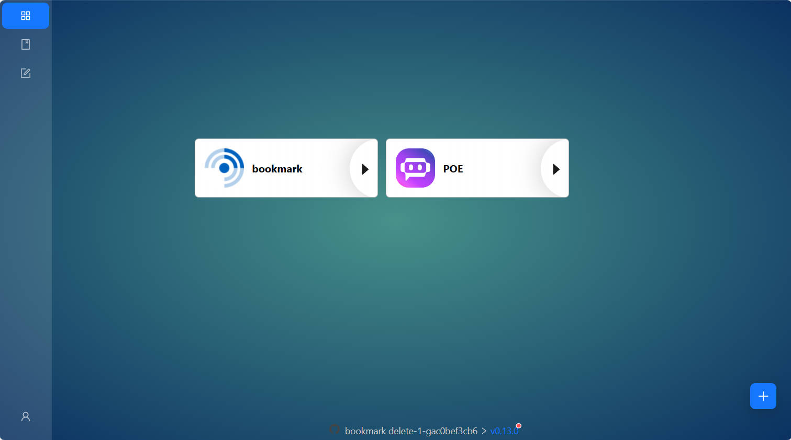
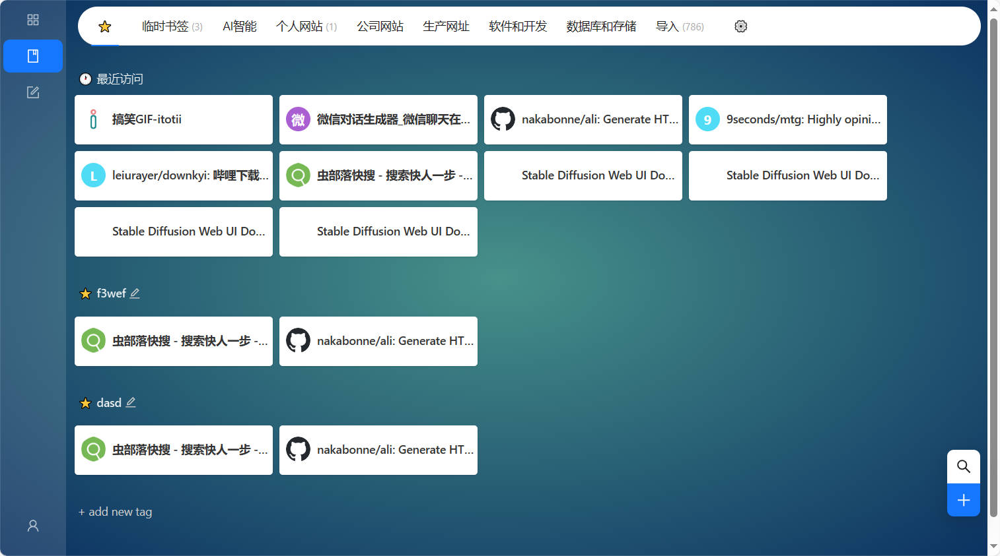
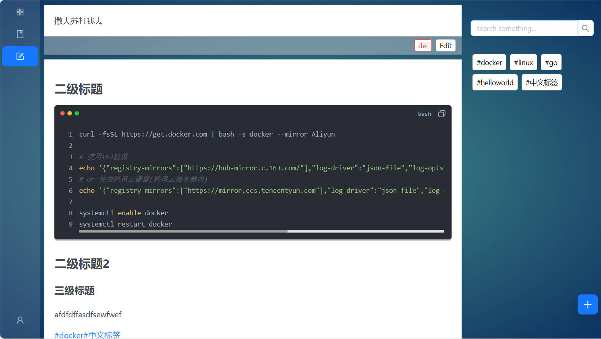

# bookmark 在线书签 
最新版本


## 特性

- [x] 检查新版本
- [x] 用户注册
### bookmark 书签
- [x] 分类新增、编辑、删除
- [x] 书签新增、编辑、删除
- [x] 书签搜索
- [x] 书签tag 过滤
- [x] 首页显示最近访问，常用书签 
- [x] html 书签导入
### notes 笔记
- [x] note 新增、编辑、删除
  - [x] 历史版本 (暂只存在数据库中)
- [x] note tag 过滤
- [x] markdown 编辑 

## 截图






## 使用
### 1. 二进制文件执行
从[下载页面](https://github.com/glennliao/bookmark/releases)下载对应平台

####  使用
1. 执行 ./bookmark init 创建配置文件(默认为sqlite数据库)
2. ~~执行 ./bookmark createUser 创建用户~~ 登录页面注册
3. 执行 ./bookmark 启动

### 2. docker-compose 部署

```yaml
version: "3"
services:
  bookmark:
    image: glennliao/bookmark:latest
    container_name: bookmark
    restart: always
    # 使用mysql可外部挂载配置文件 config.toml , 默认使用sqlite， 需将数据库文件挂载到 /app/bookmark.db
    # 如果需要上传自定义图标, 需要将 /app/runtime挂载出来
    #volumes:
    #  - ./config.toml:/app/config.toml  
    ports:
      - 8082:8082
```


### 3 .源码编译 部署
1. 安装 goframe cli工具
2. 编译 前端 
```bash
cd ui && pnpm i && pnpm run build:prod
```
> 生成的静态文件会打包到packed目录中

3. 编译后端
```bash
# linux/amd64
gf build -s linux -a amd64 main.go
```
