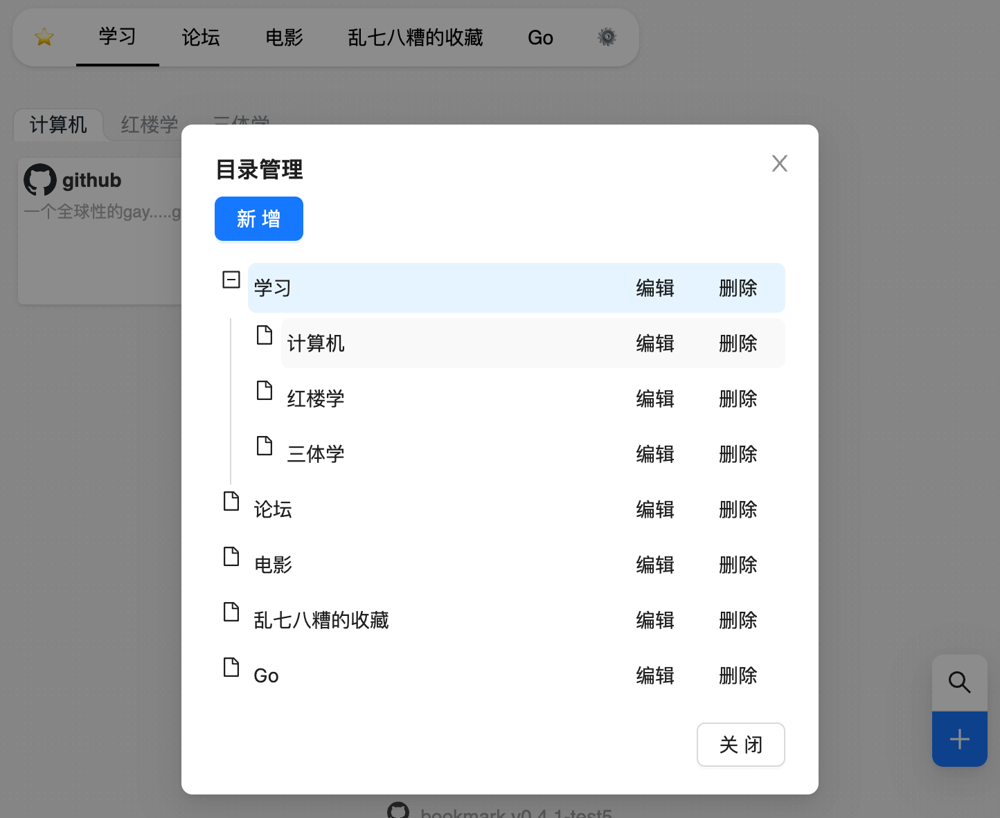
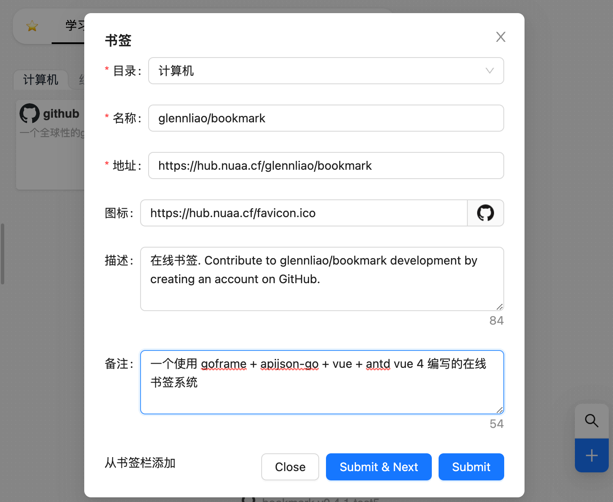

# bookmark 在线书签


## 截图




## 使用
### 源码编译 部署
1. 安装 goframe cli工具
2. 编译 前端 
```bash
cd ui && pnpm i && pnpm run build:prod
```
> 生成的静态文件会打包到packed目录中

3. 编译后端
```bash
# linux/amd64
gf build -s linux -a amd64 main.go
```

####  使用
1. 执行 ./main init 创建配置文件(默认为sqlite数据库)
2. 执行 ./main createUser 创建用户
3. 执行 ./main 启动

### docker-compose 部署

```yaml
version: "3"
services:
  bookmark:
    image: glennliao/bookmark:latest
    container_name: bookmark
    restart: always
    # 使用mysql可外部挂载配置文件 config.toml , 默认使用sqlite， 需将数据库文件挂载到 /app/bookmark.db
    #volumes:
    #  - ./config.toml:/app/config.toml  
    ports:
      - 8082:8082
```


## changelog

### todo
- 分类拖动排序
- 书签排序
- 用户注册

### 0.4.1 (2023-06-17)
- fix 分类无法删除
- fix 新增子分类导致父级消失 (编辑后未清空数据)
- 增加docker部署支持


### 0.4 (2023-06-10)
- 分类编辑，删除
- 书签编辑，删除
- 书签搜索
- 添加从浏览器收藏夹快速添加的支持
- 使用apijson-go v0.2.0-beta4 以上版本

